# FBClicker - AI-Powered Facebook Group Moderation Bot

Automated moderation bot for Facebook group member requests using **Computer Vision** and **AI-powered OCR**. Control approvals and rejections remotely via **Telegram**.

## 🎯 Overview

FBClicker monitors Facebook group member requests and sends notifications to a Telegram admin. The admin can approve or decline requests with inline buttons, and the bot executes those actions automatically on Facebook.

### Key Features

- 🤖 **AI-Powered OCR** - Uses Surya OCR for accurate name extraction from member request cards
- 👁️ **Computer Vision** - OpenCV-based card detection and button localization
- 🕵️ **Stealth Mode** - Advanced anti-detection measures (fingerprint spoofing, human-like behavior)
- 📱 **Telegram Control** - Remote moderation via inline buttons
- 🔄 **Persistent Sessions** - Resume where you left off without re-login
- 📸 **Post Preview Capture** - Automatically captures member's recent posts for review

---

## 🧠 AI/Vision Pipeline

The bot uses a sophisticated computer vision pipeline to process Facebook's UI:

```mermaid
flowchart LR
    A[📸 Screenshot] --> B[🔲 OpenCV Card Detection]
    B --> C[✂️ Card Segmentation]
    C --> D[📝 Surya OCR]
    D --> E[👤 Name Extraction]
    E --> F{Decision?}
    F -->|Pending| G[📱 Telegram Notification]
    F -->|Approved/Declined| H[🖱️ Button Click]
    H --> I[🔄 Re-scan Page]
```



### 1. Card Detection (`src/vision/card_detector.py`)

Uses **OpenCV** to segment Facebook's member request cards:

- **Separator Detection**: Finds uniform gray horizontal lines (`std < 15`) between cards
- **Avatar Detection**: Fallback using Hough Circle Transform for profile pictures
- **Template Matching**: Locates cards on screen after page reflow (`TM_CCOEFF_NORMED > 0.7`)
- **Button Detection**: HSV color-based detection for Approve (blue) and Decline (gray) buttons

```python
# Blue button detection (Approva)
lower_blue = np.array([100, 150, 150])
upper_blue = np.array([120, 255, 255])

# Gray button detection (Rifiuta)
lower_gray = np.array([0, 0, 210])
upper_gray = np.array([180, 25, 248])
```

### 2. OCR Engine (`src/actions/group_moderator.py`)

Uses **Surya OCR** (GPU-accelerated, but runs in CPU mode in Docker):

```python
from surya.models import load_predictors

predictors = load_predictors()
det_predictor = predictors["detection"]
rec_predictor = predictors["recognition"]

# Process card image
predictions = rec_predictor([image], ["ocr_with_boxes"], det_predictor)
```

**Why Surya over Tesseract?**
- Better accuracy on styled/anti-aliased text
- Handles Facebook's modern fonts reliably
- Returns bounding boxes for precise text localization

### 3. Coordinate System

```
┌─────────────────────────────────────────────────┐
│                   HEADER (56px)                 │
├─────────┬───────────────────────────────────────┤
│         │         FILTER BAR (220px)            │
│ SIDEBAR │───────────────────────────────────────│
│ (360px) │  ┌─────────────────────────────────┐  │
│         │  │  [Avatar]  Name                 │  │
│         │  │           └───────────────┐     │  │
│         │  │           [Approva][Rifiuta]    │  │
│         │  └─────────────────────────────────┘  │
│         │     ↑ CARD 0 detected Y range        │
│         │  ┌─────────────────────────────────┐  │
│         │  │        CARD 1 ...               │  │
│         │  └─────────────────────────────────┘  │
└─────────┴───────────────────────────────────────┘
```

Button positions are calculated relative to card edges:
- **Approva**: `card_width - 475px` from right edge
- **Rifiuta**: `card_width - 290px` from right edge
- **Y offset**: Fixed at `46px` from top of card

---

## 🕵️ Anti-Detection Countermeasures

Facebook uses sophisticated bot detection. This bot implements multiple layers of evasion:

### 1. Browser Fingerprint Spoofing

**WebGL Fingerprint** - Randomly spoofed vendor/renderer:
```javascript
// Injected at page load
WebGLRenderingContext.prototype.getParameter = function(param) {
    if (param === 37445) return 'Google Inc. (NVIDIA)';  // VENDOR
    if (param === 37446) return 'ANGLE (NVIDIA, GeForce GTX 1080)';  // RENDERER
    return original.call(this, param);
};
```

**Canvas Fingerprint Noise** - Subtle pixel modifications prevent canvas fingerprinting:
```javascript
const originalToDataURL = HTMLCanvasElement.prototype.toDataURL;
HTMLCanvasElement.prototype.toDataURL = function() {
    const ctx = this.getContext('2d');
    // Add imperceptible noise
    const imageData = ctx.getImageData(0, 0, this.width, this.height);
    for (let i = 0; i < imageData.data.length; i += 4) {
        imageData.data[i] += Math.floor(Math.random() * 2);  // R
    }
    ctx.putImageData(imageData, 0, 0);
    return originalToDataURL.apply(this, arguments);
};
```

**Audio Context Fingerprint** - Consistent spoofed values:
```javascript
AudioContext.prototype.createAnalyser = function() {
    const analyser = original.call(this);
    analyser.frequencyBinCount = 1024;  // Fixed value
    return analyser;
};
```

### 2. Navigator & Automation Flag Hiding

```javascript
// Hide webdriver flag
Object.defineProperty(navigator, 'webdriver', { get: () => undefined });

// Fake plugins array
Object.defineProperty(navigator, 'plugins', {
    get: () => [/* Chrome PDF Plugin, etc. */]
});

// Fake languages
Object.defineProperty(navigator, 'languages', {
    get: () => ['it-IT', 'it', 'en-US', 'en']
});
```

### 3. Fingerprint Persistence

The bot saves a **consistent fingerprint** across sessions to avoid triggering "new device" detection:

```python
# data/sessions/fingerprint.json
{
    "user_agent": "Mozilla/5.0 (Windows NT 10.0; Win64; x64)...",
    "viewport": {"width": 1920, "height": 1080},
    "timezone": "Europe/Rome",
    "locale": "it-IT"
}
```

Same User-Agent, viewport, and locale are reused on every launch.

### 4. Tracker & Fingerprint Script Blocking

Requests to known tracking/fingerprinting domains are blocked:

```python
BLOCKED_DOMAINS = [
    "**/datadome.co/**",       # Bot detection
    "**/google-analytics.com/**",
    "**/googletagmanager.com/**",
    "**/facebook.com/tr/**",   # Facebook Pixel
    "**/connect.facebook.net/signals/**",
    "**/perimeterx.net/**",    # Bot detection
    "**/imperva.com/**",       # Bot detection
    "**/kasada.io/**",         # Bot detection
]
```

### 5. Human-Like Behavior Simulation

**Mouse Movement** - Cubic Bézier curves instead of linear paths:

```python
def generate_bezier_path(start, end, num_points=15):
    # Random control points for natural curve
    ctrl1 = (start[0] + random.uniform(0.2, 0.4) * (end[0] - start[0]),
             start[1] + random.uniform(-50, 50))
    ctrl2 = (start[0] + random.uniform(0.6, 0.8) * (end[0] - start[0]),
             end[1] + random.uniform(-50, 50))
    
    # Generate points along curve
    return [bezier_point(t, start, ctrl1, ctrl2, end) 
            for t in np.linspace(0, 1, num_points)]
```

**Gaussian Timing** - Human reaction times follow bell curves, not uniform distributions:

```python
def gaussian_random(mean, std, min_val=0.1):
    """Human-like delay with natural variation."""
    return max(min_val, random.gauss(mean, std))

# Usage: wait 1-3 seconds with gaussian distribution
await asyncio.sleep(gaussian_random(2.0, 0.5))
```

**Typing Simulation** - Variable inter-key delays with occasional pauses:

```python
async def human_type(self, selector, text):
    for char in text:
        await self.page.type(selector, char)
        # Random delay between keystrokes (80-200ms)
        await asyncio.sleep(random.uniform(0.08, 0.2))
        # Occasional "thinking" pause (5% chance)
        if random.random() < 0.05:
            await asyncio.sleep(random.uniform(0.5, 1.5))
```

**Micro-movements** - Small random movements while "reading" content:

```python
async def micro_movements(self):
    """Small jitters like a real hand on mouse."""
    for _ in range(random.randint(2, 5)):
        dx = random.randint(-5, 5)
        dy = random.randint(-5, 5)
        await self.page.mouse.move(current_x + dx, current_y + dy)
        await asyncio.sleep(random.uniform(0.1, 0.3))
```

### 6. Session Persistence

Instead of creating a new browser session each time (which triggers 2FA/CAPTCHA), the bot:

1. Saves cookies and localStorage to `data/sessions/facebook_session.json`
2. Reuses the same session file on restart
3. Manual login only needed once per device

### 7. Timing Jitter

Poll intervals include random variation to avoid detection patterns:

```python
# Base: 3600 seconds (1 hour)
# Jitter: ±30%
# Actual interval: 2520-4680 seconds

def _get_jittered_interval(self):
    base = settings.poll_interval  # 3600
    jitter = settings.poll_jitter  # 0.3
    variation = random.uniform(-jitter, jitter)
    return int(base * (1 + variation))
```

### 8. Working Hours Awareness

Bot only operates during realistic human hours (06:00-22:00) to avoid suspicion:

```python
current_hour = datetime.now().hour
if not (6 <= current_hour < 22):
    logger.info("Outside working hours, sleeping...")
    await asyncio.sleep(self._get_jittered_interval())
```

---


## 📁 Project Structure

```
fbclicker/
├── src/
│   ├── main.py                 # Entry point & main loop
│   ├── config.py               # Pydantic settings from .env
│   ├── cache.py                # Decision persistence (JSON)
│   ├── browser/
│   │   ├── stealth_browser.py  # Playwright + anti-detection
│   │   └── human_behavior.py   # Bézier curves, gaussian delays
│   ├── vision/
│   │   ├── card_detector.py    # OpenCV card segmentation
│   │   └── screenshot_analyzer.py  # Page type detection
│   ├── actions/
│   │   ├── facebook_login.py   # Session verification
│   │   └── group_moderator.py  # Core moderation + Surya OCR
│   └── telegram/
│       └── bot.py              # Inline buttons & notifications
├── manual_login.py             # One-time login helper
├── docker-compose.yml          # Production deployment
├── Dockerfile                  # CPU-optimized PyTorch
└── requirements.txt            # Dependencies
```

---

## ⚙️ Configuration

Copy `.env.example` to `.env` and configure:

| Variable | Description |
|----------|-------------|
| `FB_EMAIL` | Facebook login email |
| `FB_PASSWORD` | Facebook password |
| `FB_GROUP_ID` | Group ID (e.g., `mygroup` from URL) |
| `TELEGRAM_BOT_TOKEN` | From @BotFather |
| `TELEGRAM_ADMIN_ID` | Your Telegram user ID |
| `OPENROUTER_API_KEY` | For AI click validation (optional) |
| `POLL_INTERVAL` | Seconds between scans (default: 3600) |
| `POLL_JITTER` | Random variation ±30% (default: 0.3) |
| `HEADLESS` | Run browser headless (default: true) |

---

## 🚀 Quick Start

### 1. Clone & Configure

```bash
git clone https://github.com/yourusername/fbclicker.git
cd fbclicker
cp .env.example .env
# Edit .env with your credentials
```

### 2. Manual Login (Required Once)

The bot requires a valid Facebook session. Create one manually to avoid CAPTCHAs:

```bash
# Option 1: X11 Forwarding (if you have X Server)
docker compose run --rm -e HEADLESS=false fbclicker python manual_login.py

# Option 2: VNC (recommended for remote servers)
docker compose run --rm -p 5900:5900 fbclicker ./vnc_login.sh
# Connect VNC client to localhost:5900
```

### 3. Run Production

```bash
docker compose up -d
docker compose logs -f
```

---

## 📱 Telegram Commands

| Command | Description |
|---------|-------------|
| `/start` | Welcome message |
| `/status` | Show bot status & pending decisions |
| `/pause` | Pause moderation |
| `/resume` | Resume moderation |
| `/help` | List commands |

**Inline Buttons**: Each notification has ✅ Approva / ❌ Rifiuta buttons.

---

## 🔄 Workflow

```mermaid
sequenceDiagram
    participant Admin
    participant Telegram
    participant Bot
    participant Facebook
    participant Cache

    loop Every poll_interval (±jitter)
        Bot->>Facebook: Navigate to Member Requests
        Bot->>Bot: Screenshot + OpenCV Card Detection
        Bot->>Bot: Surya OCR on each card
        
        alt Name has pending decision
            Bot->>Facebook: Click Approve/Decline
            Bot->>Cache: mark_executed()
            Bot->>Telegram: ✅ Eseguito: Name
        else New request
            Bot->>Telegram: 📥 New request + screenshot
            Bot->>Cache: add_notification()
        end
    end

    Admin->>Telegram: Click Approve/Decline button
    Telegram->>Cache: set_decision(name, action)
    Note over Cache: Executed at next poll
```



---

## 🐛 Troubleshooting

### Session Expired / White Page
**Cause**: Fingerprint mismatch between login and production.  
**Fix**: Run `manual_login.py` in the same Docker environment as production.

### Card Detection Failed
**Cause**: Facebook UI changed or viewport too wide.  
**Fix**: Adjust constants in `card_detector.py`:
```python
SIDEBAR_WIDTH = 360
FILTER_BAR_HEIGHT = 220
```

### OCR Missing Names
**Cause**: Surya models not loaded or image quality issue.  
**Fix**: Check Docker logs for model loading. Ensure screenshots are high-res.

---

## 🛠️ Tech Stack

| Component | Technology |
|-----------|------------|
| Browser Automation | Playwright + playwright-stealth |
| OCR Engine | Surya OCR (CPU mode) |
| Computer Vision | OpenCV (card detection, button finding) |
| Telegram Bot | python-telegram-bot |
| Configuration | Pydantic Settings |
| LLM Validation | OpenRouter API (optional) |

---

## 📋 Roadmap

- [ ] Better "Decline" confirmation dialog handling
- [ ] 2FA support via Telegram
- [ ] Moderation statistics dashboard
- [ ] Multi-group support

---

## 📄 License

MIT License - See [LICENSE](LICENSE) for details.
